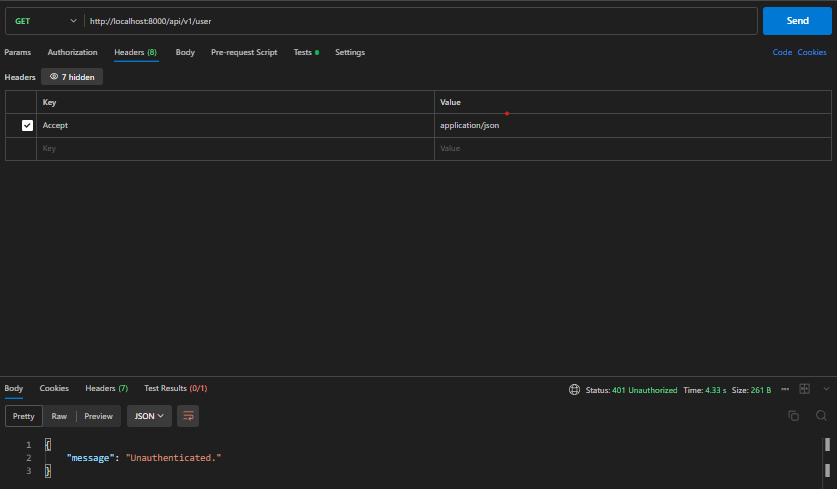

# Exercise User Management REST API Using Sanctum API in Laravel 11
REST API for basic user management using Sanctum API. For now, this project is still in development stage. The implementation results can be seen in the below.


## Prerequisite:

- Composer >= 2.8
- PHP >= 8.3


## Features

- Authentication With Token Based
- User Management (Create and Read)


## Screenshots




## Run Locally

Clone the project

```bash
  git clone https://github.com/brianajiks123/Exercise-User-Management-Laravel-11-Sanctum-API.git
```

Go to the project directory

```bash
  cd Exercise-User-Management-Laravel-11-Sanctum-API
```

Install Dependencies (Laravel)

```bash
  composer install
```

Migrate Database (make sure already setup your environment in the .env file)

```bash
  php artisan migrate
```

Running Development

```bash
  php artisan serve
```


## Testing Using API Client (Such as Postman)

### Routes
- POST http://localhost:8000/api/v1/register
- POST http://localhost:8000/api/v1/login
- GET http://localhost:8000/api/v1/user
- GET http://localhost:8000/api/v1/logout


## API Reference

Headers:
- accept: application/json

### Register

```http
  POST /api/v1/register
```

| Body                 | Type     | Description                       |
| :------------------- | :------- | :-------------------------------- |
| `name`               | `string` | **Required**                      |
| `phone_number`       | `string` | **Required**                      |
| `email`              | `string` | **Required**. Valid email         |
| `password`           | `string` | **Required**. Min. 8 characters   |

### Login

```http
  POST /api/v1/login
```

| Body                 | Type     | Description                       |
| :------------------- | :------- | :-------------------------------- |
| `email`              | `string` | **Required**. Valid email         |
| `password`           | `string` | **Required**. Min. 8 characters   |

### Get User Profile

Authorization:
- Bearer Token: auth token

```http
  GET /api/v1/user
```

### Logout

Authorization:
- Bearer Token: auth token

```http
  GET /api/v1/logout
```


## Tech Stack

**Server:** Laravel 11, Sanctum API, MySQL, Git, Apache Web Server, Postman, VS Code, Windows 11


## Acknowledgements

 - [Laravel](https://laravel.com/docs/11.x)


## Authors

- [@brianajiks123](https://www.github.com/brianajiks123)
